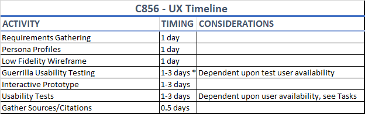
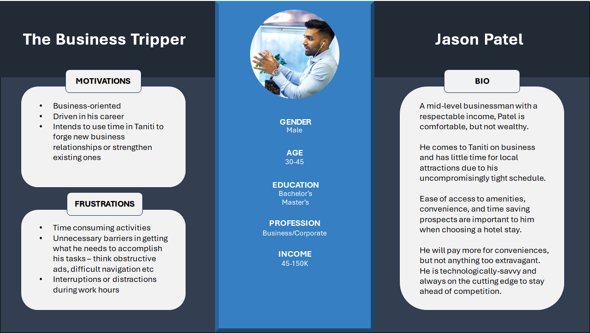
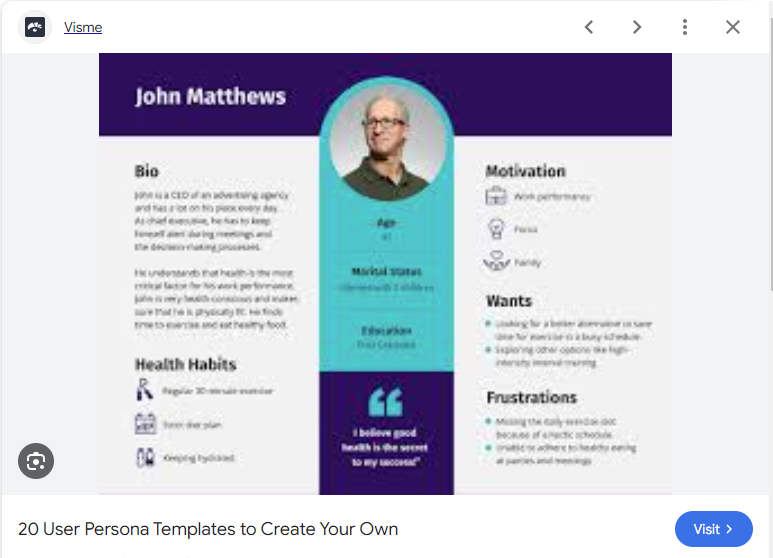

# C856 - User Experience Design

This repository is intended for the Performance Assessments (Tasks 1 & 2) of C856, User Experience Design.

## Scenario

> You have been contacted by the local government of the small island of Taniti. Since the island’s economy relies heavily on tourism, the Tanitian government has developed a plan to increase the number of tourists who visit the island and its attractions. As part of this plan, they have hired you to design a tourism website.

> The Tanitian government has conducted a survey to gather information about current tourists. Their findings from this survey are shown in the “Survey Results” supporting document. The government has also provided you with the attached “About the Island” document to better inform you about Taniti and its visitors.

> Taniti’s current website has an outdated look and feel. The page navigation is unclear. All the tourist information is jumbled together on a single page, and the site lacks booking information and links to each activity or option. The site is also not compatible with mobile devices.

> The Tanitian government would like you to spend no more than one month designing a new website that will increase tourism on the island of Taniti and provide a welcoming experience for prospective tourists."

## Projected Timeline

Per the requirements:

> A. Create a timeline of the UX design activities that will take place during this project.

I built a basic timeline using an Excel spreadsheet of the activities required to create a new design for the Tanitian tourism website, consisting of the following:

1. Requirements Gathering - 1-3 days.

   a. I supposed that this process would be continual throughout the project, as the requirements for different stages of the project would vary. The first "Requirements Gathering" phase in this respect involved reviewing the Survey Results and crafting a User Persona from the data.

2. Persona Profiles - 1 day.

   a. I used Powerpoint to create a basic template of a user persona, then used a Table to divide the data in Excel into separate categories that could represent specific types of users. The rubric states to "Create a Persona Profile", but I spent a bit of extra time to create a persona for each type of user in the survey. They can be reviewed under /assets/personas.

3. Low Fidelity Wireframe - 1 day.

   a. This will also require another round of "Requirements Gathering" - I have not started this phase yet, but plan to spend a bit of time researching other tourism sites to see what kinds of designs tourism sites generally have, to give me some ideas about how the Tanitian tourism site should be structured.

4. Guerrilla Usability Testing - 1-3 days.

   a. This was the timeline I was most unsure of next to Usability Tests, as it depends upon the response time from those I ask to do the testing. As anyone I could ask also works, I decided to give extra time for the Testing categories in case there were any delays in getting responses from test users.

5. Interactive Prototype - 1-3 days.

   a. A basic website with only HTML/CSS functionality shouldn't take too long to build, but I wanted to give myself a bit of extra time to try and make a well-structured prototype that would be easy to adjust upon feedback from test users. Given I also have to work, the time I can spend on building the website out will be somewhat limited on workdays.

6. Usability Tests - 1-3 days.

a. Again, like the Guerilla Testing category, I wanted to give myself extra time not just for hearing back from test users, but also for the sake of having time to make proposed adjustments. Hopefully, with well-structured code, making proposed adjustments to the design will not be as time-consuming. 12. Gather Sources/Citations - 0.5 days.

a. I have been keeping a Word document off to the side with any sources I have used to create assets, such as the persona stock photos. That way, compiling the sources at the end will not be as difficult.

Tools: Microsoft Excel

# User Personas

> B. Create a persona profile based on the attached “Survey Results” and “About the Island” supporting documents.

Using the Survey Results data, I split the data into the most common categories and crafted User Personas based on the data provided. Below is an example of one such Persona:

Each Persona profile consists of three main sections:

1. The Central Pillar, consisting of a photo of the User along with their general demographics (think Gender, Age, Education level, Income).
2. To the left side of this Pillar is the General Category information, with the title of the category, followed by that category's general Motivations and Frustrations. In this example, it is "The Business Tripper".
3. To the right side of the Pillar is the Specific Persona information - this is a fictional character crafted by using the data in the Survey to create a potential User that fits within that category. It includes a short Bio (description) of that User, and the kinds of things they may want or need during their trip. In this case, the Bio represents a young businessman named John Patel.

Tools: Microsoft Powerpoint, Google Search (for inspiration - see Sources & Citations)

## Low Fidelity Wireframe

> C. Create a low-fidelity wireframe showing the suggested flow of your new design for the Tanitian website.

## Guerilla Usability Testing

> D. Conduct guerrilla usability testing with at least three user testers and then do the following:
>
> 1.  Summarize the qualitative feedback you received, specifying which feedback is or is not actionable and relevant to your design.
> 2.  Explain how you will incorporate the feedback you received to improve your design.

[Pending.]

## Interactive Prototype

> E. Create an interactive prototype for the Tanitian website that reflects your wireframe design and incorporates the feedback you received during guerrilla testing. Your prototype must be submitted as a URL link.

[Here](https://tourtaniti.netlify.app/)

Tools: Visual Studio Code, HTML, CSS, ReactJS, Vite

## Usability Testing

> F. List five objective usability tasks you want users to test in Task 2 for your prototype.

1. Check that links in the navbar appropriately scroll down to the correct section.
2. Check that the navbar collapses for smaller screensizes.
3. Check responsiveness for smaller screen sizes - ex: are all sections visible in a smaller screen size, or do they start to overlap? (This was something I had issues with when building it, and I think I fixed it, but would appreciate other people testing it as well).
4. Is the intended purpose of each section apparent, given the design?
5. Is the text legible at both desktop and mobile screen sizes?

## Sources & Citations

> G. Acknowledge sources, using in-text citations and references, for content that is quoted, paraphrased, or summarized and for images or graphics from another resource.

### Image Sources

#### User Personas Pictures

Business Man: Terp, Rene. “Photo of a Man Sitting on Chair near Table · Free Stock Photo.” Pexels, June 2019, [Pexels.com](www.pexels.com/photo/photo-of-a-man-sitting-on-chair-near-table-2505026/).

Wedding Spouses: Nguyen, Trung. “Selective Focus Photography of Couple on Brown Grass Field · Free Stock Photo.” Pexels, Jan. 2019, [Pexels.com](www.pexels.com/photo/selective-focus-photography-of-couple-on-brown-grass-field-1751681/).

Vacationing Family: Kampus Production. “Family at the Beach Photos, Download the Best Free Family at the Beach Stock Photos & HD Images.” Pexels, Kampus Production, July 2021, [Pexels.com](www.pexels.com/search/Family%20at%20the%20beach/).

Sports Team: Pixabay. “Group of Sports Player Kneeling on Field · Free Stock Photo.” Pexels, Pixabay, Dec. 2016, [Pexels.com](www.pexels.com/photo/action-activity-adult-athletes-262524/).

Bridal Party: Renee, Kayla. “Cheerful Fiancee and Bridesmaids with Beautiful Bouquets · Free Stock Photo.” Pexels, Nov. 2018, [Pexels.com](www.pexels.com/photo/cheerful-fiancee-and-bridesmaids-with-beautiful-bouquets-1608589/).

#### Stay Page Images

[Pending]

#### Dining Page Images

[Pending]

### Reference Sources

For User Persona Template inspiration, the actual websites of most image results were not accessible at the time I was working on them (due to site blocking on work network), so I simply did my best imitation of the design in Powerpoint. This was the specific image I used for inspiration:

“20 User Persona Templates to Create Your Own.” Visme Blog, Visme, 19 June 2024, [Visme](visme.co/blog/user-persona-template/).

For building a tourism website, I checked several tourism websites, but took much inspiration from:
“Visit Tampa Bay.” Tampa, Florida Vacations | Visit Tampa Bay, www.visittampabay.com/. Accessed 20 July 2024.
